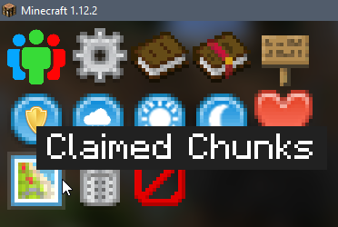
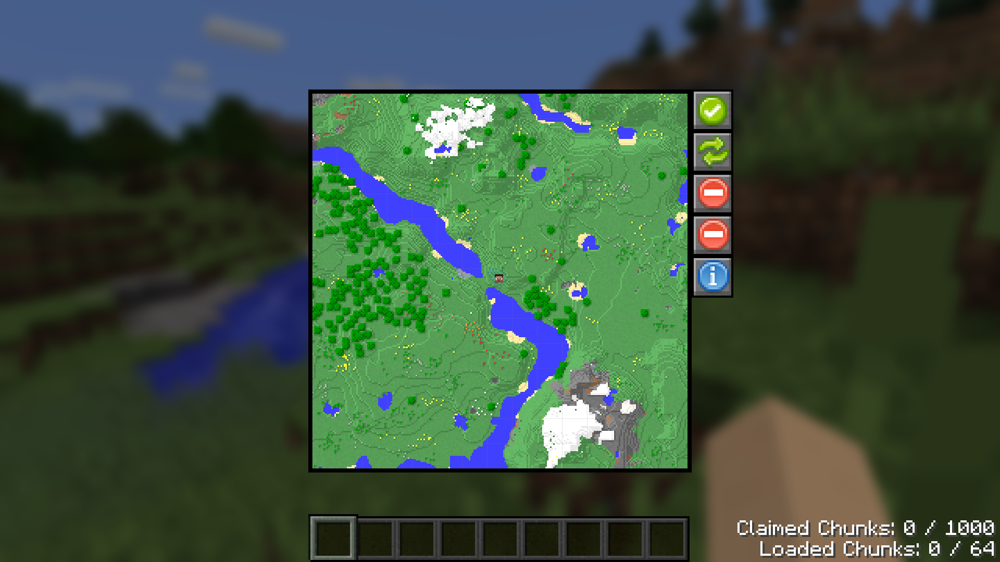
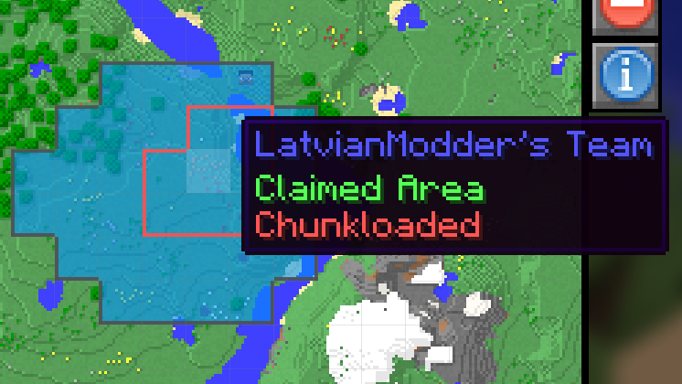

FTBUtilities allows you to protect your base with Claimed Chunks. Claimed chunks will be by default accessible to your team and team allies. You can also disable explosions and fake player interactions.
To open the GUI, you must click on the Claimed Chunks sidebar button.

---

* Left-click or drag chunks in the map to claim them
* Right-click to unclaim a chunk
* Shift-left-click to load a claimed chunk
* Shift-right-click to unload a claimed chunk

You can drag mouse to claim/unclaim/load/unload larger area at once.

